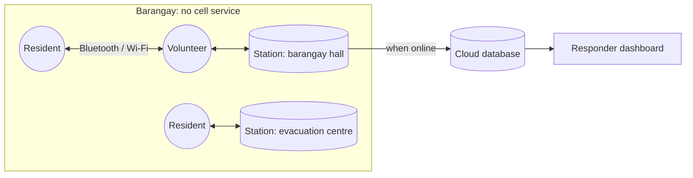

<div align="center">

# Pasabi

**When the towers fall, the barangay passes it on.**

*Pasabi* (Filipino: a message you ask someone to pass along)
**P**eer-carried **A**lerts, **S**ynthesized **A**nd **B**arangay-**I**ndexed


</div>

> **Draft README.** Pasabi is being built during the Beginner's Paradise: FirstCommit hackathon (Sept 2026). Features marked *planned* aren't finished yet, and this document will change as the project does.

---

## Overview

When a typhoon knocks out power, cell towers go dark with it. For the first 24–48 hours, a barangay's disaster-response team only knows what people walk in and tell them, usually as a pile of duplicate, scattered reports.

Pasabi turns the phones already in the community into the network. Residents and volunteers record short, structured **observations** ("flood water entering the road", "3 households need water"). Phones pass those observations to each other over Bluetooth and Wi-Fi whenever they come near one another, with no signal or internet needed. Every phone groups related observations into **incidents**, counts how many independent people reported each one, and ranks them with a transparent urgency score.

At the barangay hall or evacuation centre, a **station** device shows the whole picture on a situation board. When any device reaches the internet, everything uploads and responders see the same picture, including **what changed since the last sync**.

> Pasabi doesn't pass along messages. It builds a shared picture: **observation → incident → corroboration → situation picture**.

## Features

| Feature | Status |
|---|---|
| Structured observation form (works fully offline, English + Filipino) | Done |
| Phone-to-phone exchange over Bluetooth / Wi-Fi (Multipeer on iOS, Nearby on Android) | Planned |
| On-device incident engine: grouping, corroboration, urgency with explanation | Done |
| Station mode: situation board, acknowledge / resolve, "what changed" | Done |
| Automatic upload when any device gets internet | Planned |
| Responder web dashboard (list, map, since-last-sync summary) | Planned |
| Signed observations (tamper resistance) | Planned, supporting |
| Android background carry service | Planned, supporting |
| SMS / satellite uplink, photos, cross-platform mesh | Later |

## How it works



1. **Observe.** Anyone records what they see: category, people affected, a short note. Location and time are attached automatically.
2. **Carry.** Devices swap the observations each other is missing, most urgent first, whenever they meet.
3. **Corroborate.** Every device groups observations of the same kind, place and time into one incident and counts independent reporters. Incidents are *computed*, not sent, so every device holding the same observations shows the same picture.
4. **Act.** Stations see a ranked situation board, with a "why ranked here" explanation for every incident, and can acknowledge or resolve incidents.
5. **Hand off.** When any device reaches the internet, observations upload and the dashboard rebuilds the same picture for municipal responders.

Ranking uses fixed, documented rules (category, number of independent reporters, people affected, how recent, whether acknowledged). No AI decides who gets help first.

## Tech stack

| Layer | Technology |
|---|---|
| App | TypeScript, React Native (Expo), Expo Router, React Native Web |
| Offline transport | Multipeer Connectivity (iOS), Google Nearby Connections (Android) |
| Local store | AsyncStorage |
| Cloud | Hosted Postgres with row-level security |
| Dashboard | The same app's web build · Leaflet + OpenStreetMap |
| Hosting | Vercel (web build) · EAS (native builds) |
| CI | GitHub Actions |

One codebase targets iOS, Android and the web. The incident engine is written **once** and runs identically on all three.

## Getting started

> Setup steps will be confirmed once the first build lands.

**Requirements**
- Node.js 20+
- Expo CLI / EAS CLI
- **At least 2–3 physical phones on the same platform.** Peer-to-peer transport doesn't work in simulators, and iOS and Android can't mesh with each other (see Known limitations).
- For iOS builds: an Apple Developer account, and a Mac or EAS cloud builds
- A hosted Postgres project for upload and the dashboard

**Run it**
```bash
git clone https://github.com/<org>/pasabi.git
cd pasabi
npm install
npm test                 # incident engine + shared test vectors
npx expo start --web     # web preview (mock transport, no real sync)
npx expo start           # native dev build
```

Create `.env` from `.env.example` with your database URL and **read-only** key. Never commit keys.

**Try it**
1. Install the dev build on 3 phones of the same platform, turn on airplane mode, then turn Bluetooth and Wi-Fi back on.
2. Set one device to Station mode.
3. Create overlapping observations on the other two, e.g. two FLOOD reports near the same spot.
4. Bring the devices near the station, with Pasabi open on screen, and watch one corroborated incident appear.

## Project structure

```
packages/core/         Rules, incident engine, store policy, sync protocol, test vectors
packages/transport/    Transport interface + iOS, Android and mock implementations
src/app/               Expo Router routes (also builds to web)
src/storage/           Local observation store and upload
db/                    Database schema and access rules
docs/                  PRD, architecture, implementation plan, decisions, build phases
```

## Documentation

- [Product requirements](docs/PRD.md)
- [Architecture](docs/ARCHITECTURE.md)
- [Implementation plan](docs/IMPLEMENTATION_PLAN.md)
- [Decision log](docs/DECISIONS.md)

## Known limitations

- **iOS carries only while the app is open.** iOS has no equivalent of Android's foreground service, so an iPhone exchanges observations while Pasabi is on screen, not passively in a pocket. Station devices stay plugged in and foregrounded; volunteers open the app when they arrive somewhere. Android restores passive background carrying.
- **iOS and Android can't mesh with each other.** Multipeer Connectivity is Apple-only and Nearby Connections is Android-only. A mixed barangay runs two separate networks that reconcile once either reaches the internet. Standardise on one platform per deployment.
- **The web build can't sync.** Browsers have no peer-to-peer radio access, so the web version is for previewing the UI and reading the responder dashboard.
- **Needs enough devices.** Pasabi works best when station devices and volunteers are set up *before* typhoon season.
- **Corroboration counts devices, not people.** One person with several phones could inflate it. Stations can resolve false incidents.
- **Grouping thresholds are initial values.** Distance and time windows need tuning with real barangays, and reports strung along a road can chain into one oversized incident — the board shows each incident's spatial extent so an operator can spot it.
- Not a replacement for official emergency channels. It bridges the gap until they're reachable.

## Related work

Pasabi builds on ideas from offline messaging and delay-tolerant networking:
- Offline messaging: Bridgefy, Briar, BitChat
- Store-carry-forward emergency relays: e.g. MeshAid
- Connectivity-based structured reporting: MapaKalamidad.ph / CogniCity

What Pasabi adds is grouping and corroborating reports **on the devices, offline**, so a barangay gets a situation picture instead of a message feed.

## Roadmap

- [ ] MVP for FirstCommit (see [implementation plan](docs/IMPLEMENTATION_PLAN.md))
- [ ] Field test with a real barangay disaster-response team
- [ ] Android background carry service
- [ ] SMS / satellite uplink for phones with satellite messaging
- [ ] Export to existing reporting platforms
- [ ] Cross-platform (iOS ↔ Android) mesh

## Team

| Name | Role |
|---|---|
| Jum Flores | Team lead |
| _TBD_ | _TBD_ |

## License

_To be decided before submission._

## Acknowledgments

Built for **Beginner's Paradise: FirstCommit 2026**.
