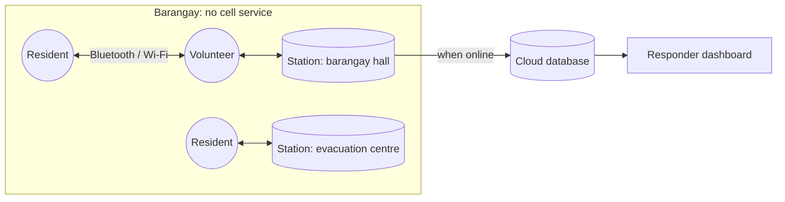

<div align="center">

# Pasabi

**When the towers fall, the barangay passes it on.**

*Pasabi* (Filipino: a message you ask someone to pass along)
**P**eer-carried **A**lerts, **S**ynthesized **A**nd **B**arangay-**I**ndexed


</div>

> **Draft README.** Pasabi is being built during the Beginner's Paradise: FirstCommit hackathon (Sept 2026). Features marked *planned* aren't finished yet, and this document will change as the project does.

---

## Overview

When a typhoon knocks out power, cell towers go dark with it. For the first 24–48 hours, a barangay's disaster-response team only knows what people walk in and tell them, usually as a pile of duplicate, scattered reports.

Pasabi turns the phones already in the community into the network. Residents and volunteers record short, structured **observations** ("flood water entering the road", "3 households need water"). Phones pass those observations to each other over Bluetooth and Wi-Fi whenever they come near one another, with no signal or internet needed. Every phone groups related observations into **incidents**, counts how many independent people reported each one, and ranks them with a transparent urgency score.

At the barangay hall or evacuation centre, a **station** phone shows the whole picture on a situation board. When any phone reaches the internet, everything uploads and responders see the same picture, including **what changed since the last sync**.

> Pasabi doesn't pass along messages. It builds a shared picture: **observation → incident → corroboration → situation picture**.

## Features

| Feature | Status |
|---|---|
| Structured observation form (works fully offline, English + Filipino) | Planned |
| Phone-to-phone exchange over Bluetooth / Wi-Fi (Google Nearby Connections) | Planned |
| On-device incident engine: grouping, corroboration, urgency with explanation | Planned |
| Station mode: situation board, acknowledge / resolve, "what changed" | Planned |
| Automatic upload when any phone gets internet | Planned |
| Responder web dashboard (list, map, since-last-sync summary) | Planned |
| Signed observations (tamper resistance) | Planned, supporting |
| SMS / satellite uplink, photos, iOS | Later |

## How it works



1. **Observe.** Anyone records what they see: category, people affected, a short note. Location and time are attached automatically.
2. **Carry.** Phones swap the observations each other is missing, most urgent first, whenever they meet.
3. **Corroborate.** Every phone groups observations of the same kind, place and time into one incident and counts independent reporters. Incidents are *computed*, not sent, so every phone holding the same observations shows the same picture.
4. **Act.** Stations see a ranked situation board, with a "why ranked here" explanation for every incident, and can acknowledge or resolve incidents.
5. **Hand off.** When any phone reaches the internet, observations upload and the dashboard rebuilds the same picture for municipal responders.

Ranking uses fixed, documented rules (category, number of independent reporters, people affected, how recent, whether acknowledged). No AI decides who gets help first.

## Tech stack

| Layer | Technology |
|---|---|
| Android app | Kotlin, Jetpack Compose, Room, WorkManager |
| Offline transport | Google Nearby Connections (Bluetooth, BLE, Wi-Fi) |
| Cloud | Supabase (Postgres + row-level security) |
| Dashboard | TypeScript, Vite, Leaflet + OpenStreetMap |
| CI | GitHub Actions |

## Getting started

> Setup steps will be confirmed once the first build lands.

**Requirements**
- Android Studio (latest stable), JDK 17
- **At least 2–3 physical Android phones (Android 10+).** Nearby Connections doesn't work on emulators.
- Node.js 20+ (dashboard)
- A Supabase project (free tier) for upload and the dashboard

**Run the app**
```bash
git clone https://github.com/<org>/pasabi.git
cd pasabi
./gradlew testDebugUnitTest      # run core tests
./gradlew installDebug           # install on a connected phone
```

**Run the dashboard**
```bash
cd dashboard
npm install
npm test                          # includes the shared incident-engine test vectors
npm run dev
```

Create `dashboard/.env` from `.env.example` with your Supabase URL and **read-only** key. Never commit keys.

**Try it**
1. Install on 3 phones, turn on airplane mode, then turn Bluetooth and Wi-Fi back on.
2. Set one phone to Station mode.
3. Create overlapping observations on the other two, e.g. two FLOOD reports near the same spot.
4. Bring the phones near the station and watch one corroborated incident appear.

## Project structure

```
app/          Android app (core rules and incident engine, data, nearby, UI)
dashboard/    Responder web dashboard
shared/       Rule constants and test vectors shared by app and dashboard
supabase/     Database schema and access rules
docs/         PRD, architecture, implementation plan, decisions, build phases
```

## Documentation

- [Product requirements](docs/PRD.md)
- [Architecture](docs/ARCHITECTURE.md)
- [Implementation plan](docs/IMPLEMENTATION_PLAN.md)
- [Decision log](docs/DECISIONS.md)

## Known limitations

- **Android only** for now.
- **Needs enough phones.** Pasabi works best when station phones and volunteers are set up *before* typhoon season.
- **Corroboration counts devices, not people.** One person with several phones could inflate it. Stations can resolve false incidents.
- Grouping thresholds (distance, time window) are initial values and need tuning with real barangays.
- Not a replacement for official emergency channels. It bridges the gap until they're reachable.

## Related work

Pasabi builds on ideas from offline messaging and delay-tolerant networking:
- Offline messaging: Bridgefy, Briar, BitChat
- Store-carry-forward emergency relays: e.g. MeshAid
- Connectivity-based structured reporting: MapaKalamidad.ph / CogniCity

What Pasabi adds is grouping and corroborating reports **on the phones, offline**, so a barangay gets a situation picture instead of a message feed.

## Roadmap

- [ ] MVP for FirstCommit (see [implementation plan](docs/IMPLEMENTATION_PLAN.md))
- [ ] Field test with a real barangay disaster-response team
- [ ] SMS / satellite uplink for phones with satellite messaging
- [ ] Export to existing reporting platforms
- [ ] iOS support

## Team

| Name | Role |
|---|---|
| Jum Flores | Team lead |
| _TBD_ | _TBD_ |

## License

_To be decided before submission._

## Acknowledgments

Built for **Beginner's Paradise: FirstCommit 2026**.
