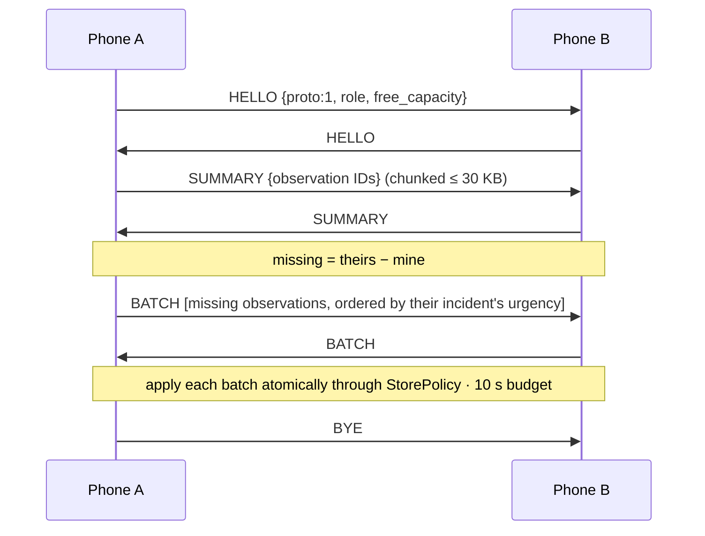

# Pasabi: Architecture

## 1. Overview

Each Android phone stores a bounded set of immutable **observations**. Phones that meet swap the observations each other is missing, most urgent first. Every phone runs the same deterministic **incident engine** over whatever observations it holds, so the incident picture is *computed locally*, never sent. That's why phones never disagree about what they're looking at. Stations are phones with bigger storage and a situation-board screen. When any phone reaches the internet, it uploads its observations to a hosted Postgres table, and the web dashboard runs the same engine (TypeScript port) to rebuild the picture.

```mermaid
flowchart LR
  subgraph Barangay["Barangay (no cell service)"]
    R1((Resident)) <-- Nearby BT/Wi-Fi --> V((Volunteer))
    V <-- Nearby --> S1[(Station: barangay hall)]
    R2((Resident)) <-- Nearby --> S2[(Station: evac centre)]
    V <-- Nearby --> S2
  end
  S1 -- HTTPS when online --> DB[(Postgres: observations)]
  V -- HTTPS when online --> DB
  DB --> D[Responder dashboard\n(TS incident engine)]
```

## 2. Components

| Component | Responsibility | Notes |
|---|---|---|
| `core/Rules.kt` | All constants: categories, R, T, weights, capacities, TTLs | Single source of truth, mirrored in `shared/rules.json` for the TS port |
| `core/IncidentEngine.kt` | Observations → incidents, corroboration, status, urgency + breakdown | Pure Kotlin, no Android imports; tested against `shared/test-vectors/` |
| `core/StorePolicy.kt` | Eviction and expiry (BR-008/009), rate limit (BR-010) | Pure Kotlin |
| `core/SyncProtocol.kt` | HELLO → SUMMARY → BATCH → BYE; urgency-ordered transfer | Pure Kotlin, tested with a fake transport |
| `data/` (Room) | `Observation` table, station snapshot table for "what changed" | Every insert runs `StorePolicy` in the same transaction |
| `nearby/CarryService` | Foreground service (`connectedDevice`); advertise/discover; runs SyncProtocol | Strategy `P2P_CLUSTER`, service ID `ph.pasabi.v1` |
| `data/Uplink` | WorkManager job with a network constraint; idempotent upload | Marks observations uploaded |
| `ui/` (Compose) | Observation form, My data, Station board, Incident detail, Onboarding | Station screens behind a PIN |
| `dashboard/` | Static web app: TS engine port, list, Leaflet map, "since last sync" | Reads Postgres via a read-only key |
| `supabase/` | `schema.sql`, `rls.sql` | Insert-only role for phones |

## 3. Incident engine

**Input:** observation set O and a timestamp `now`. **Output:** a list of incidents, sorted.

1. Split REPORT observations by category; set aside `SAFE_CHECKIN` (counted per area) and `STATUS` (applied in step 4).
2. Per category, link two observations if `|t₁ − t₂| ≤ T` **and** (both have GPS and haversine distance ≤ R, **or** their normalized area texts are equal and non-empty). Normalization: lowercase, trim, collapse spaces.
   - Use a ~150 m grid so only neighbouring cells are compared (O(n) average).
   - Groups = connected components (union-find), so the result doesn't depend on input order.
3. For each group compute: key (min ID), independent reporters (distinct `device_id`), corroboration level, people affected (max reported), first/last seen (`created_at`), centroid (mean lat/lon of GPS members) or area text.
4. Status: find STATUS observations whose `refs` intersect the group. **Resolved** if a RESOLVE exists created after the group's latest REPORT; otherwise **acknowledged** if any ACK exists; otherwise **open**.
5. Score with BR-005. Keep each term in `breakdown` so the UI can show "why ranked here".
6. Sort by score desc, then last seen desc, then key asc.

**Determinism rules.** Times are integer epoch seconds. Distance comparisons use the same haversine formula in both languages. `now` is an explicit parameter (never read inside the engine). Test vectors keep distances away from exact threshold boundaries.

**What changed.** The station stores a snapshot `{key → score, reporters, status, observation IDs}` each time the operator taps *Mark as seen*. Comparing it with the current output gives *new*, *escalated*, *newly corroborated* and *resolved* incidents (incidents are matched across snapshots by overlapping observation IDs). The dashboard does the same with a past snapshot rebuilt from observations whose `first_uploaded_at` is before the viewer's last visit.

## 4. Sync protocol



- Payloads are Nearby `BYTES` messages kept ≤ 30 KB each (check the current limit in the Nearby docs).
- Skip a peer for 2 minutes after a sync that exchanged nothing.
- A summary of 3,000 IDs is ~48 KB, so it's chunked. Past ~10k observations, switch to Bloom-filter summaries.
- This is epidemic routing with priority-based buffer management, a known delay-tolerant-networking technique. The new part is **what** is ranked: incidents derived on every phone, not individual messages.

## 5. Data model

```sql
-- Room (device)
Observation(id TEXT PK, type TEXT, category TEXT NULL, people INT NULL, note TEXT NULL,
            lat REAL NULL, lon REAL NULL, accuracy_m REAL NULL, area_text TEXT NULL,
            created_at INTEGER, device_id TEXT, refs TEXT NULL, action TEXT NULL, sig BLOB NULL,
            received_at INTEGER, hops INTEGER, own INTEGER, uploaded INTEGER)
StationSnapshot(taken_at INTEGER PK, json TEXT)

-- Postgres (server)
observations(id uuid PK, type text, category text, people int, note text,
             lat double precision, lon double precision, area_text text,
             created_at timestamptz, device_id text, refs uuid[], action text,
             first_uploaded_at timestamptz default now(), upload_count int default 1)
```

Upload: `INSERT … ON CONFLICT (id) DO UPDATE SET upload_count = observations.upload_count + 1`.

## 6. Security

- Per-install key pair in Android Keystore (ECDSA P-256). `device_id` = hash of the public key. Observations are signed (supporting scope); receivers drop invalid ones.
- Postgres row-level security: the anon role can only insert/upsert `observations`; the dashboard uses a read-only view. For a real deployment the dashboard should require responder login (post-hackathon).
- No admin/service key in the APK or dashboard bundle.

## 7. Android constraints

- **Permissions:** `BLUETOOTH_SCAN/ADVERTISE/CONNECT`, `NEARBY_WIFI_DEVICES` (33+), `ACCESS_FINE_LOCATION`, `POST_NOTIFICATIONS` (33+), `FOREGROUND_SERVICE_CONNECTED_DEVICE` (34+).
- **Radios:** from late 2026, Nearby Connections won't switch Bluetooth/Wi-Fi on for the app. Check them and prompt the user.
- **Background:** carry mode runs as a foreground service. Ask for a battery-optimization exemption and document OEM auto-start settings (Xiaomi, OPPO, vivo, realme) in the README.
- **Testing:** Nearby doesn't work in emulators. Physical phones are required.

## 8. Stack

| Layer | Choice |
|---|---|
| App | Kotlin, Jetpack Compose, Room, WorkManager, Google Nearby Connections |
| Server | Supabase Postgres + auto REST + RLS (verify current free-tier limits) |
| Dashboard | TypeScript + Vite, Leaflet with OpenStreetMap tiles, 10 s polling |
| CI | GitHub Actions: Kotlin unit tests + TS engine tests on the same `shared/test-vectors/` |

## 9. Architecture decisions

**ADR-001: Native Kotlin.** *Proposed (D-001).* Nearby Connections, foreground services and permissions are first-party Android APIs; Flutter would put a community plugin between the team and the hardest part. Trade-off: no iOS path (out of scope anyway).

**ADR-002: Incidents are derived on every device, never transmitted.** *Proposed.* Only immutable observations travel. Every node computes incidents with the same deterministic rules, so any two nodes holding the same observations agree with no coordination, conflicts or merge logic. Trade-off: the engine must be identical in Kotlin and TypeScript (ADR-005). Alternative rejected: sending incident objects, which would need conflict resolution when two phones group differently.

**ADR-003: Hosted Postgres (Supabase), no custom backend.** *Proposed.* The server only stores observations idempotently and serves reads. Trade-off: vendor dependency; free projects may pause when idle (check the current policy and wake it before the demo).

**ADR-004: Rule-based urgency, not ML.** *Proposed.* Deciding who gets help first must be explainable and auditable. Every score shows its breakdown. Weights live in `Rules.kt` and are a documented decision.

**ADR-005: Engine implemented twice (Kotlin + TypeScript) with shared test vectors.** *Proposed.* The engine is ~200–300 lines. Porting and testing it against the same JSON vectors is simpler for this team and timeline than setting up Kotlin Multiplatform for a JS target. Revisit KMP if the engine grows.

## 10. Testing

- **Unit (Kotlin + TS):** grouping, corroboration, status, scoring, order-independence (shuffle test), eviction keeps incident summaries, rate limit, sync diffing.
- **Shared vectors:** `shared/test-vectors/*.json` hold `{now, observations[], expected_incidents[]}`, run in both CI jobs.
- **Field test:** 3–4 phones in airplane mode (Bluetooth/Wi-Fi on). Scripted observations: 3 FLOOD reports from 3 phones near the same spot, 1 ROAD_BLOCKED, 5 WATER_FOOD. Carry to the station, check the board, acknowledge one, reconnect, check the dashboard's "since last sync". Record delivery times and battery %/h in `docs/FIELD_TEST.md`.
