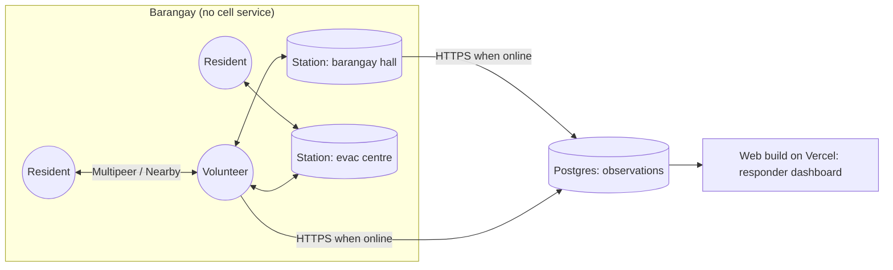
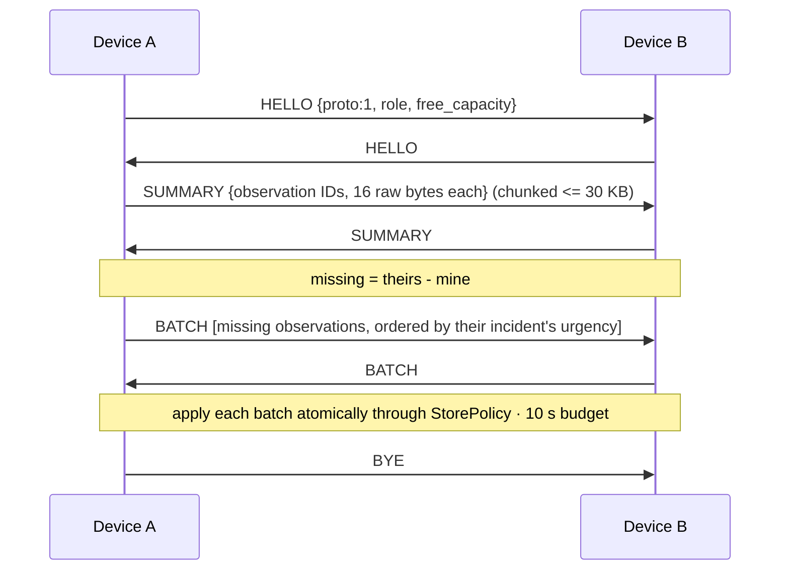

# Pasabi: Architecture

## 1. Overview

Each device stores a bounded set of immutable **observations**. Devices that meet swap the observations each other is missing, most urgent first. Every device runs the same deterministic **incident engine** over whatever observations it holds, so the incident picture is *computed locally*, never sent. That's why devices never disagree about what they're looking at. Stations are devices with bigger storage and a situation-board screen. When any device reaches the internet, it uploads its observations to a hosted Postgres table, and the web build of the same app rebuilds the picture for responders using the same engine.

One Expo codebase targets **iOS (primary), Android (secondary) and web**. The engine, the rules and the UI are shared across all three. Only the transport differs.



## 2. Components

| Component | Responsibility | Notes |
|---|---|---|
| `packages/core/rules.ts` | All constants: categories, R, T, weights, capacities, TTLs | **Single source of truth.** One language, so no mirror file and no parity test |
| `packages/core/IncidentEngine.ts` | Observations → incidents, corroboration, status, urgency + breakdown | Pure TS, no platform imports; tested against `test-vectors/` |
| `packages/core/StorePolicy.ts` | Eviction and expiry (BR-008/009), rate limit (BR-010) | Pure TS |
| `packages/core/SyncProtocol.ts` | HELLO → SUMMARY → BATCH → BYE; urgency-ordered transfer | Pure TS, driven through the `Transport` interface; tested with the mock |
| `packages/transport/` | `Transport` interface + `multipeer` (iOS), `nearby` (Android), `mock` (web, tests) | ADR-007 |
| `src/storage/` | Observation store (AsyncStorage JSON blob, D-015) + `Uplink` | Every write runs `StorePolicy` before persisting |
| `src/app/` (Expo Router) | Observation form, My data, Station board, Incident detail, Onboarding, Dashboard route | Station screens behind a PIN |
| Web build | The same app on React Native Web, deployed to Vercel: team preview + responder dashboard | Uses `mock` transport — **the web build cannot test real sync** |
| `db/` | `schema.sql`, `rls.sql` | Insert-only role for devices |

## 3. Incident engine

**Input:** observation set O and a timestamp `now`. **Output:** a list of incidents, sorted.

1. Split REPORT observations by category; set aside `SAFE_CHECKIN` (counted per `area_text`, which BR-006 requires) and `STATUS` (applied in step 4).
2. Per category, link two observations if `|t1 - t2| <= T` **and** either **(a)** both have a GPS fix and haversine distance `<= R`, or **(b)** at least one has no GPS fix and their normalized area texts are equal and non-empty (R-1). Normalization: lowercase, trim, collapse internal whitespace.
   - A time-sorted window scan with a latitude pre-reject, NOT a spatial grid. Measured in Phase 1 at 6.9 ms for 3,000 observations, about 40x inside NFR-003, so the grid would be complexity buying nothing. Revisit if the benchmark ever fails.
   - Groups = connected components (union-find), so the result doesn't depend on input order.
   - Chains are transitive and unbounded — see **D-010**.
3. For each group compute: key (smallest lowercase-UUID ID), independent reporters (distinct `device_id`), corroboration level, people affected (max reported), first/last seen (`created_at`), centroid (mean lat/lon of GPS members) or area text, and **spatial extent** (greatest distance between any two GPS members, shown in the UI as the D-010 mitigation).
4. Status: find STATUS observations whose `refs` intersect the group. **Resolved** if a RESOLVE exists created after the group's latest REPORT; otherwise **acknowledged** if any ACK exists; otherwise **open**. BR-007's creation-time clamp is what makes this comparison safe against clock skew (R-6).
5. Score with BR-005, using the integer `PEOPLE_BONUS` table — **no floating point** (R-3). Keep each term in `breakdown` so the UI can show "why ranked here". **Clamp open scores at a minimum of 0** (R-2).
6. Sort by: resolved last (explicit status key, never by score value — R-2), then score desc, then last seen desc, then key asc.

**Determinism rules.** Times are integer epoch seconds. Scoring is integer arithmetic end to end. Haversine is used only for a threshold comparison, and test vectors keep distances away from exact boundaries. `now` is an explicit parameter, never read inside the engine. IDs are lowercase UUIDs so ordering is stable on every runtime (R-8).

**What changed.** The station stores a snapshot `{key → score, reporters, status, observation IDs}` each time the operator taps *Mark as seen*. Comparing it with the current output gives *new*, *escalated*, *newly corroborated* and *resolved* incidents (incidents are matched across snapshots by overlapping observation IDs, not by key). The dashboard does the same with a past snapshot rebuilt from observations whose `first_uploaded_at` is before the viewer's last visit.

## 4. Sync protocol



- Payloads are kept <= 30 KB each (confirm the current limit for each platform's transport).
- Summaries carry **binary UUIDs, 16 raw bytes per ID** (R-9). A 3,000-ID summary is then ~48 KB and chunks into two payloads; as 36-character strings it would be ~111 KB.
- Skip a peer for 2 minutes after a sync that exchanged nothing.
- Past ~10k observations, switch to Bloom-filter summaries.
- This is epidemic routing with priority-based buffer management, a known delay-tolerant-networking technique. The new part is **what** is ranked: incidents derived on every device, not individual messages.

## 5. Data model

```ts
// Device: one JSON blob in AsyncStorage (D-015)
type Stored = {
  observations: Observation[];                     // <= 500 resident, <= 3000 station
  snapshots: { takenAt: number; json: string }[];  // station only
};
// Observation: id, type, category?, people?, note?, lat?, lon?, accuracy_m?,
// area_text?, created_at (epoch seconds), device_id, refs?, action?, sig?,
// received_at, hops, own, uploaded
```

```sql
-- Postgres (server)
observations(id uuid PK, type text, category text, people int, note text,
             lat double precision, lon double precision, area_text text,
             created_at timestamptz, device_id text, refs uuid[], action text,
             first_uploaded_at timestamptz default now(), upload_count int default 1)
```

Upload: `INSERT … ON CONFLICT (id) DO UPDATE SET upload_count = observations.upload_count + 1`.

A 3,000-observation station store is roughly 900 KB of JSON — well inside AsyncStorage and localStorage limits, and the engine already loads the whole set into memory to compute incidents, so a database buys nothing yet. Upgrade to `expo-sqlite` if the store outgrows this.

## 6. Security

- Per-install key pair kept in `expo-secure-store` (iOS Keychain / Android Keystore). `device_id` = hash of the public key. Observations are signed (supporting scope); receivers drop invalid ones. The signing library is still open — WebCrypto where available, otherwise a vetted RN crypto package.
- Postgres row-level security: the anon role can only insert/upsert `observations`; the dashboard reads a read-only view. For a real deployment the dashboard should require responder login (post-hackathon).
- No admin/service key in the app bundle or the web bundle.

## 7. Platform constraints

**iOS (primary)**
- Transport is **Multipeer Connectivity** (Bluetooth + peer-to-peer Wi-Fi, no internet needed). Needs a custom native module and an Expo **dev build** — Expo Go cannot load it.
- **No foreground-service equivalent.** The app is suspended shortly after backgrounding, and Multipeer effectively requires the foreground. Carry mode is therefore an explicit, foregrounded action (D-013). Core Bluetooth background modes could do something slower and less reliable, but that is the out-of-scope custom BLE stack.
- Info.plist: `NSBluetoothAlwaysUsageDescription`, `NSLocalNetworkUsageDescription`, `NSBonjourServices`, location usage strings.
- Distribution needs a Mac or EAS cloud builds, an Apple Developer account, and TestFlight or registered devices (D-011).

**Android (secondary)**
- Transport is **Nearby Connections**, `Strategy.P2P_CLUSTER`, service ID `ph.pasabi.v1`.
- Permissions: `BLUETOOTH_SCAN/ADVERTISE/CONNECT`, `NEARBY_WIFI_DEVICES` (33+), `ACCESS_FINE_LOCATION`, `POST_NOTIFICATIONS` (33+), `FOREGROUND_SERVICE_CONNECTED_DEVICE` (34+).
- A foreground service restores passive background carrying — an enhancement over the iOS baseline, not the baseline itself. Ask for a battery-optimization exemption and document OEM auto-start settings (Xiaomi, OPPO, vivo, realme) in the README.

**Web (Vercel)**
- **No peer transport exists in a browser.** Web Bluetooth is absent from iOS Safari entirely and cannot advertise as a peripheral anywhere; WebRTC needs a signalling server, which needs the internet Pasabi assumes is gone. The web build therefore runs the `mock` transport.
- Its job is the team preview surface and the responder dashboard (D-016). **A green Vercel preview never means sync works** — transport only proves out on real devices.

**Cross-platform (D-012).** Multipeer is Apple-only and Nearby Connections is Android-only; they do not interoperate. iOS and Android form two separate meshes that reconcile only through the cloud uplink — which is free, because ADR-002 means observations simply pool and every device recomputes the same incidents.

**Radios.** Apps cannot switch Bluetooth/Wi-Fi on for the user. Check them and prompt.

## 8. Stack

| Layer | Choice |
|---|---|
| App | TypeScript, React Native (Expo), Expo Router, React Native Web |
| Transport | Multipeer Connectivity (iOS), Nearby Connections (Android), mock (web/tests) |
| Local store | AsyncStorage JSON blob (D-015) |
| Server | Hosted Postgres — Supabase or Vercel Postgres, **D-006 open** |
| Dashboard | The same app's web build; Leaflet with OpenStreetMap tiles; 10 s polling |
| Hosting | Vercel (web build: team preview + dashboard), EAS (native builds) |
| CI | GitHub Actions: `npm test` (engine + vectors), typecheck, web build |

## 9. Architecture decisions

**ADR-001: Native Kotlin.** *Superseded by ADR-006.*

**ADR-002: Incidents are derived on every device, never transmitted.** *Proposed.* Only immutable observations travel. Every node computes incidents with the same deterministic rules, so any two nodes holding the same observations agree with no coordination, conflicts or merge logic. Alternative rejected: sending incident objects, which would need conflict resolution when two devices group differently. This is also what makes D-012's two islands reconcile for free once they share observations.

**ADR-003: Hosted Postgres, no custom backend.** *Proposed, provider open (D-006).* The server only stores observations idempotently and serves reads.

**ADR-004: Rule-based urgency, not ML.** *Proposed.* Deciding who gets help first must be explainable and auditable. Every score shows its breakdown. Weights live in `rules.ts` and are a documented decision.

**ADR-005: Engine implemented twice (Kotlin + TypeScript).** *Superseded by ADR-006.* With one language the engine is written **once**, and NFR-002's cross-language risk disappears. This was the stated cost of ADR-002; the pivot removes it.

**ADR-006: React Native (Expo) + React Native Web, one codebase, iOS-first.** *Accepted (D-014).* One TypeScript codebase serves iOS, Android and web, so the engine, rules and UI are written once and the dashboard becomes a route rather than a separate port. Trade-offs: the iOS transport needs a custom native module; carry mode must be designed to iOS's foreground-only constraint (D-013); and the two platforms cannot mesh with each other (D-012).

**ADR-007: Transport behind an interface with three implementations.** *Accepted.* `Transport` is implemented by `multipeer`, `nearby` and `mock`. This is not speculative abstraction — three implementations exist on day one, and the mock is what makes encounter sync testable in CI and in the browser without any hardware.

## 10. Testing

- **Unit:** grouping, corroboration, status, scoring, order-independence (shuffle test), the 0-clamp and resolved sort, eviction keeps incident summaries, the last-resort eviction rung, rate limit, sync diffing.
- **Shared vectors:** `packages/core/test-vectors/*.json` hold `{now, observations[], expected_incidents[]}`. Expectations for the named behavioural cases are **hand-written from the rules**, not generated from engine output; bulk order-independence fixtures may be generated.
- **Simulated encounters:** `SyncProtocol` runs against the `mock` transport in CI and in the browser — multi-device convergence is testable with no phones.
- **Field test:** 3–4 devices **on one platform** in airplane mode (Bluetooth/Wi-Fi on). Scripted observations: 3 FLOOD reports from 3 devices near the same spot, 1 ROAD_BLOCKED, 5 WATER_FOOD. Carry to the station, check the board, acknowledge one, reconnect, check the dashboard's "since last sync". Record delivery times and battery %/h in `docs/FIELD_TEST.md`.
