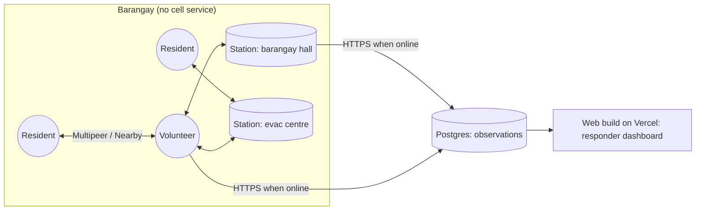
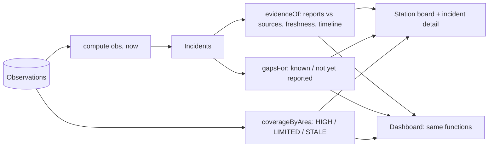
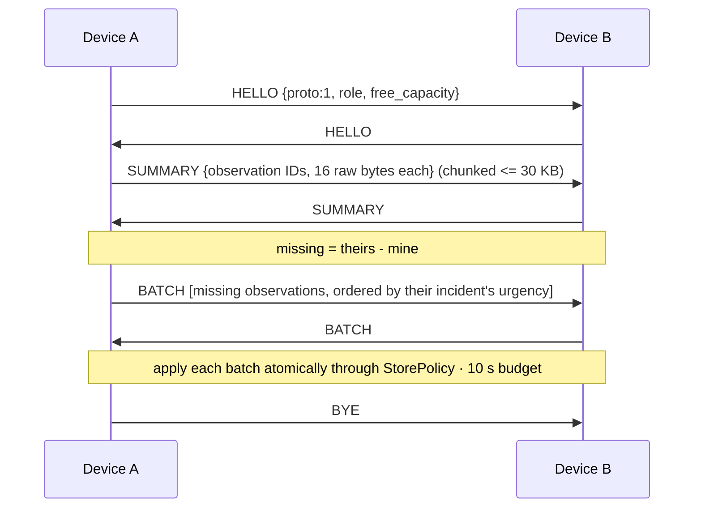

# Pasabi: Architecture

## 1. Overview

Each device stores a bounded set of immutable **observations**. Devices that meet swap the observations each other is missing, most urgent first. Every device runs the same deterministic **incident engine** over whatever observations it holds, so the incident picture is *computed locally*, never sent. That's why devices never disagree about what they're looking at. Stations are devices with bigger storage and a situation-board screen. When any device reaches the internet, it uploads its observations to a hosted Postgres table, and the web build of the same app rebuilds the picture for responders using the same engine.

One Expo codebase targets **iOS (primary), Android (secondary) and web**. The engine, the rules and the UI are shared across all three. Only the transport differs.

**This round (2026-09-27, D-019/D-020/D-024):** the team has iPhones only, so phones pass observations by **QR bundle** (§4a) inside **Expo Go**; Multipeer is a stretch (D-021) and Nearby is deferred. On top of the engine sits an **evidence layer** (§3a) — reports vs sources, freshness, timeline, known/unknown, coverage — computed the same way on every phone and on the dashboard.


```mermaid
flowchart LR
  subgraph Barangay["Barangay (no cell service)"]
    R1((Resident)) <-- Multipeer / Nearby --> V((Volunteer))
    V <--> S1[(Station: barangay hall)]
    R2((Resident)) <--> S2[(Station: evac centre)]
    V <--> S2
  end
  S1 -- HTTPS when online --> DB[(Postgres: observations)]
  V -- HTTPS when online --> DB
  DB --> D[Web build on Vercel: responder dashboard]
```

## 2. Components

| Component | Responsibility | Notes |
|---|---|---|
| `packages/core/rules.ts` | All constants: categories, R, T, weights, capacities, TTLs | **Single source of truth.** One language, so no mirror file and no parity test |
| `packages/core/IncidentEngine.ts` | Observations → incidents, corroboration, status, urgency + breakdown | Pure TS, no platform imports; tested against `test-vectors/` |
| `packages/core/StorePolicy.ts` | Eviction and expiry (BR-008/009), rate limit (BR-010) | Pure TS |
| `packages/core/wire.ts` | Message framing and binary UUID encoding (R-9) | Pure TS |
| `packages/core/SyncProtocol.ts` | HELLO → SUMMARY → BATCH → BYE; urgency-ordered transfer | Pure TS, driven through the `Transport` interface; tested with the mock |
| `packages/core/ingest.ts` *(R0)* | `toWire(o)` strips local-only fields before any send; `asReceived(o, now)` resets them on arrival (BR-016) | Pure TS. The **only** way observations enter or leave a device |
| `packages/core/Evidence.ts`, `Gaps.ts`, `Coverage.ts` *(R1, R4, R5)* | Evidence, known/unknown and per-area coverage derived from `compute()` output | Pure TS, `now` as a parameter, never change grouping or scoring |
| `packages/core/qr.ts` *(R2)* | QR bundle frames, assembler, receipt (ADR-008) | Pure TS; reuses `encodeBatch`, `urgencyByObservation`, `toWire` |
| `src/storage/observations.ts` → `receiveObservations()` *(R0)* | One ingest path for anything that arrives: QR bundles now, `SyncSession` later | `asReceived` then `applyPolicy`, serialized with the other writes |
| `packages/transport/` | `Transport` interface + `multipeer` (iOS), `nearby` (Android), `mock` (web, tests) | ADR-007 |
| `src/storage/` | Observation store (AsyncStorage JSON blob, D-015) + `Uplink` | Every write runs `StorePolicy` before persisting |
| `src/app/` (Expo Router) | Observation form, My data, Station board, Incident detail, Onboarding, Dashboard route | Station screens behind a PIN |
| Web build | The same app on React Native Web, deployed to Vercel: team preview + responder dashboard | Uses `mock` transport — **the web build cannot test real sync** |
| `db/` | `schema.sql`, `rls.sql` | Insert-only role for devices |

## 3. Incident engine

**Input:** observation set O and a timestamp `now`. **Output:** a list of incidents, sorted.

1. Split REPORT observations by category; set aside `SAFE_CHECKIN` (counted per `area_text`, which BR-006 requires) and `STATUS` (applied in step 4).
2. Per category, link two observations if `|t1 - t2| <= T` **and** either **(a)** both have a GPS fix and haversine distance `<= R`, or **(b)** at least one has no GPS fix and their normalized area texts are equal and non-empty (R-1). Normalization: lowercase, trim, collapse internal whitespace.
   - A time-sorted window scan with a latitude pre-reject, NOT a spatial grid. Measured in Phase 1 at 6.9 ms for 3,000 observations, about 40x inside NFR-003, so the grid would be complexity buying nothing. Revisit if the benchmark ever fails.
   - Groups = connected components (union-find), so the result doesn't depend on input order.
   - Chains are transitive and unbounded — see **D-010**.
3. For each group compute: key (smallest lowercase-UUID ID), independent reporters (distinct `device_id`), corroboration level, people affected (max reported), first/last seen (`created_at`), centroid (mean lat/lon of GPS members) or area text, and **spatial extent** (greatest distance between any two GPS members, shown in the UI as the D-010 mitigation).
4. Status: find STATUS observations whose `refs` intersect the group. **Resolved** if a RESOLVE exists created after the group's latest REPORT; otherwise **acknowledged** if any ACK exists; otherwise **open**. BR-007's creation-time clamp is what makes this comparison safe against clock skew (R-6).
5. Score with BR-005, using the integer `PEOPLE_BONUS` table — **no floating point** (R-3). Keep each term in `breakdown` so the UI can show "why ranked here". **Clamp open scores at a minimum of 0** (R-2).
6. Sort by: resolved last (explicit status key, never by score value — R-2), then score desc, then last seen desc, then key asc.

**Determinism rules.** Times are integer epoch seconds. Scoring is integer arithmetic end to end. Haversine is used only for a threshold comparison, and test vectors keep distances away from exact boundaries. `now` is an explicit parameter, never read inside the engine. IDs are lowercase UUIDs so ordering is stable on every runtime (R-8).

**What changed.** The station stores a snapshot `{key → score, reporters, status, observation IDs}` each time the operator taps *Mark as seen*. Comparing it with the current output gives *new*, *escalated*, *newly corroborated* and *resolved* incidents (incidents are matched across snapshots by overlapping observation IDs, not by key). The dashboard does the same with a past snapshot rebuilt from observations whose `first_uploaded_at` is before the viewer's last visit.

## 3a. Evidence layer (R1, R4, R5)

Everything here is computed **from** the engine's output and never feeds back into it, so the 11 hand-computed vectors stay valid and grouping, scoring and `status` are untouched.


```mermaid
flowchart LR
  O[(Observations)] --> E[compute obs, now]
  E --> I[Incidents]
  I --> EV[evidenceOf: reports vs sources, freshness, timeline]
  I --> G[gapsFor: known / not yet reported]
  O --> C[coverageByArea: HIGH / LIMITED / STALE]
  EV & G & C --> B[Station board + incident detail]
  EV & G & C --> D[Dashboard: same functions]
```

- **Freshness** is a separate field (`fresh | aging | stale`), not a new `IncidentStatus` — vector 10 asserts `status` on a stale incident.
- **Timeline** must reuse the engine's STATUS-to-incident matching (export the existing helper; behaviour unchanged) rather than reimplement it, or the timeline and the status badge can disagree.
- **Source labels** are the first **6** hex characters of `device_id`. Four characters collide too often: about a 7 % chance among 100 devices.
- **Gaps cost** is O(incidents²) if computed for every incident: 110 ms for all 1,705 benchmark incidents on a laptop, 0.04 ms for one. Compute it for the incident being viewed, not the whole board. Measure nearness **member to member**, not centroid to centroid: 3.5 % of benchmark incidents span more than 300 m.
- **Coverage** reads all observation types, because any activity from an area is evidence someone is there.

## 4. Sync protocol



```mermaid
sequenceDiagram
  participant A as Device A
  participant B as Device B
  A->>B: HELLO {proto:1, role, free_capacity}
  B->>A: HELLO
  A->>B: SUMMARY {observation IDs, 16 raw bytes each} (chunked <= 30 KB)
  B->>A: SUMMARY
  Note over A,B: missing = theirs - mine
  A->>B: BATCH [missing observations, ordered by their incident's urgency]
  B->>A: BATCH
  Note over A,B: apply each batch atomically through StorePolicy · 10 s budget
  A->>B: BYE
```

- Payloads are kept <= 30 KB each (confirm the current limit for each platform's transport).
- Summaries carry **binary UUIDs, 16 raw bytes per ID** (R-9). A 3,000-ID summary is then ~48 KB and chunks into two payloads; as 36-character strings it would be ~111 KB.
- Skip a peer for 2 minutes after a sync that exchanged nothing.
- Past ~10k observations, switch to Bloom-filter summaries.
- This is epidemic routing with priority-based buffer management, a known delay-tolerant-networking technique. The new part is **what** is ranked: incidents derived on every device, not individual messages.

## 4a. QR bundle transfer (R2, ADR-008)

A one-way, camera-read transfer that needs no radio, no native module and no Apple account, and works between any two phones.

```mermaid
sequenceDiagram
  participant A as Phone A (shares)
  participant B as Phone B (scans)
  Note over A: page = held obs, minus IDs B already acknowledged,<br/>most urgent first, max QR_MAX_OBSERVATIONS, toWire()
  A-->>B: frames PSB1:bundle:i/n:base64 (cycling, any order)
  Note over B: BundleAssembler until n/n → receiveObservations()
  B-->>A: receipt PSR1:bundle:role:deviceId (one frame)
  Note over A: mark passed_on / reached_station;<br/>remember IDs acknowledged by deviceId
  Note over A,B: swap roles for the other direction
```

- **Paging (D-025).** The share screen shows page 1 of however many; "Next page" continues. The sender remembers, per receiver `device_id` taken from receipts, which IDs that receiver acknowledged and leaves them out next time. A fixed top-60 bundle would resend the same 60 at every exchange, and lower-ranked observations would never cross.
- **No summary exchange.** Unlike `SyncProtocol`, the sender cannot know what the receiver holds except through past receipts. Duplicates are harmless (ingest dedupes by ID); they only cost scans.
- **Receipts are trusted, not verified.** A receipt claiming `station` role marks "reached a station". That is as honest as the receipt; it is stated, not hidden.
- **Frames** are base64 of `fflate.deflateSync(encodeBatch(toWire(...)))`, split at `QR_FRAME_CHARS` = 500 (D-027): 18 frames per 60-observation page instead of 33, measured in `docs/analysis/ARGUS_constants.md`. The assembler accepts any order and duplicates, and rejects frames from another bundle.
- **Re-verify QR scanning if R6 moves the app to a development build.** A reported SDK 55 issue disabled `expo-camera` barcode scanning in an EAS development build using static frameworks (expo/expo#44491). Expo Go is not affected by that build setting.

## 5. Data model

```ts
// Device: one JSON blob in AsyncStorage (D-015)
type Stored = {
  observations: Observation[];                     // <= 500 resident, <= 3000 station
  snapshots: { takenAt: number; json: string }[];  // station only
};
// Observation: id, type, category?, people?, note?, lat?, lon?, accuracy_m?,
// area_text?, created_at (epoch seconds), device_id, refs?, action?, sig?,
// received_at, hops, own, uploaded, passed_on (R3), reached_station (R3)
// The last six are LOCAL-ONLY (BR-016): stripped by toWire() before any sync,
// QR bundle or upload, and reset by asReceived() on arrival.
// Sender-side, local only (R2): acknowledged-by map { receiverDeviceId -> observation IDs }
```

```sql
-- Postgres (server)
observations(id uuid PK, type text, category text, people int, note text,
             lat double precision, lon double precision, area_text text,
             created_at timestamptz, device_id text, refs uuid[], action text,
             first_uploaded_at timestamptz default now(), upload_count int default 1)
```

Upload: `INSERT … ON CONFLICT (id) DO UPDATE SET upload_count = observations.upload_count + 1`.

A 3,000-observation station store is roughly 900 KB of JSON — well inside AsyncStorage and localStorage limits, and the engine already loads the whole set into memory to compute incidents, so a database buys nothing yet. Upgrade to `expo-sqlite` if the store outgrows this.

## 6. Security

- Per-install key pair kept in `expo-secure-store` (iOS Keychain / Android Keystore). `device_id` = hash of the public key. Observations are signed (supporting scope); receivers drop invalid ones. The signing library is still open — WebCrypto where available, otherwise a vetted RN crypto package.
- Postgres row-level security: the anon role can only insert/upsert `observations`; the dashboard reads a read-only view. For a real deployment the dashboard should require responder login (post-hackathon).
- No admin/service key in the app bundle or the web bundle.

## 7. Platform constraints

**Expo Go runtime, this round (D-024).** Expo Go loads PASAbi's JavaScript from the laptop's dev server; it is not bundled into an installed app. Once loaded, the app keeps running with no network, and AsyncStorage persists. But a reload, or iOS killing Expo Go in the background, cannot restart the app offline. Demo protocol: open PASAbi on every phone while online, switch to airplane mode, keep PASAbi in the foreground, never reload. Verify FR-002 (survives a restart) with the network on — persistence is local either way. A standalone or development build removes this limit and needs D-019's open part.

**iOS (primary)**
- Transport is **Multipeer Connectivity** (Bluetooth + peer-to-peer Wi-Fi, no internet needed). Needs a custom native module and an Expo **dev build** — Expo Go cannot load it.
- **No foreground-service equivalent.** The app is suspended shortly after backgrounding, and Multipeer effectively requires the foreground. Carry mode is therefore an explicit, foregrounded action (D-013). Core Bluetooth background modes could do something slower and less reliable, but that is the out-of-scope custom BLE stack.
- Info.plist: `NSBluetoothAlwaysUsageDescription`, `NSLocalNetworkUsageDescription`, `NSBonjourServices`, location usage strings.
- Distribution needs a Mac or EAS cloud builds, an Apple Developer account, and TestFlight or registered devices (D-011).

**Android (secondary)**
- Transport is **Nearby Connections**, `Strategy.P2P_CLUSTER`, service ID `ph.pasabi.v1`.
- Permissions: `BLUETOOTH_SCAN/ADVERTISE/CONNECT`, `NEARBY_WIFI_DEVICES` (33+), `ACCESS_FINE_LOCATION`, `POST_NOTIFICATIONS` (33+), `FOREGROUND_SERVICE_CONNECTED_DEVICE` (34+).
- A foreground service restores passive background carrying — an enhancement over the iOS baseline, not the baseline itself. Ask for a battery-optimization exemption and document OEM auto-start settings (Xiaomi, OPPO, vivo, realme) in the README.

**Web (Vercel)**
- **No peer transport exists in a browser.** Web Bluetooth is absent from iOS Safari entirely and cannot advertise as a peripheral anywhere; WebRTC needs a signalling server, which needs the internet Pasabi assumes is gone. The web build therefore runs the `mock` transport.
- Its job is the team preview surface and the responder dashboard (D-016). **A green Vercel preview never means sync works** — transport only proves out on real devices.

**Cross-platform (D-012).** Multipeer is Apple-only and Nearby Connections is Android-only; they do not interoperate. iOS and Android form two separate meshes that reconcile only through the cloud uplink — which is free, because ADR-002 means observations simply pool and every device recomputes the same incidents.

**Radios.** Apps cannot switch Bluetooth/Wi-Fi on for the user. Check them and prompt.

## 8. Stack

| Layer | Choice |
|---|---|
| App | TypeScript, React Native (Expo), Expo Router, React Native Web |
| Transport | Multipeer Connectivity (iOS), Nearby Connections (Android), mock (web/tests) |
| Local store | AsyncStorage JSON blob (D-015) |
| Server | Hosted Postgres — Supabase or Vercel Postgres, **D-006 open** |
| Dashboard | The same app's web build; Leaflet with OpenStreetMap tiles; 10 s polling |
| Hosting | Vercel (web build: team preview + dashboard), EAS (native builds) |
| CI | GitHub Actions: `npm test` (engine + vectors), typecheck, web build |

## 9. Architecture decisions

**ADR-001: Native Kotlin.** *Superseded by ADR-006.*

**ADR-002: Incidents are derived on every device, never transmitted.** *Proposed.* Only immutable observations travel. Every node computes incidents with the same deterministic rules, so any two nodes holding the same observations agree with no coordination, conflicts or merge logic. Alternative rejected: sending incident objects, which would need conflict resolution when two devices group differently. This is also what makes D-012's two islands reconcile for free once they share observations.

**ADR-003: Hosted Postgres, no custom backend.** *Proposed, provider open (D-006).* The server only stores observations idempotently and serves reads.

**ADR-004: Rule-based urgency, not ML.** *Proposed. Narrowed by ADR-010: AI may draft the report form, never the ranking.* Deciding who gets help first must be explainable and auditable. Every score shows its breakdown. Weights live in `rules.ts` and are a documented decision.

**ADR-005: Engine implemented twice (Kotlin + TypeScript).** *Superseded by ADR-006.* With one language the engine is written **once**, and NFR-002's cross-language risk disappears. This was the stated cost of ADR-002; the pivot removes it.

**ADR-006: React Native (Expo) + React Native Web, one codebase, iOS-first.** *Accepted (D-014). Superseded by ADR-009 (2026-09-29).* One TypeScript codebase serves iOS, Android and web, so the engine, rules and UI are written once and the dashboard becomes a route rather than a separate port. Trade-offs: the iOS transport needs a custom native module; carry mode must be designed to iOS's foreground-only constraint (D-013); and the two platforms cannot mesh with each other (D-012).

**ADR-007: Transport behind an interface with three implementations.** *Accepted.* `Transport` is implemented by `multipeer`, `nearby` and `mock`. This is not speculative abstraction — three implementations exist on day one, and the mock is what makes encounter sync testable in CI and in the browser without any hardware.

**ADR-008: QR bundle transfer sits beside `Transport`, not behind it.** *Accepted (2026-09-27).*
- *Context:* the team has iPhones only (D-019) and no confirmed way to install a native build, so Multipeer may never run this round. A real phone-to-phone path is needed that works in Expo Go.
- *Options:* (1) QR as a fake `Transport` adapter; (2) QR as its own one-way path reusing core pieces; (3) no device transfer, `/sim` only.
- *Decision:* (2). A QR exchange has no discovery, connection or two-way channel, so wrapping it in `onPeerFound`/`connect`/`send` would be a fake adapter that lies about its capabilities. It reuses what matters: `encodeBatch`, `urgencyByObservation`, `toWire`/`asReceived`, and the same store ingest path as sync.
- *Trade-offs:* slower than radio; two passes for both directions; no summary exchange, so paging and receipts (D-025) stand in for it.
- *Consequences:* `CLAUDE.md`'s transport rule gains one named exception. Session transports (Multipeer, Nearby) stay behind `Transport`. QR also works across iOS and Android, which D-012 radio transports cannot.

**ADR-009: React + Vite PWA replaces Expo.** *Accepted (D-028, 2026-09-29). Supersedes ADR-006.*
- The app installs to the Home Screen and runs offline from a service-worker cache, with user data in IndexedDB.
- `packages/core` is reused unchanged.
- There is no radio from a browser, so QR (ADR-008) is the only phone-to-phone path, and Multipeer/Nearby (R6) are dropped.
- Full text: `docs/IMPLEMENTATION_PWA.md` §1.

**ADR-010: AI boundary.** *Accepted (D-030, 2026-09-29). Narrows ADR-004 without removing it.*
- AI may only draft the report form from voice or text. It runs in a server function, and a person confirms the draft.
- Grouping, corroboration, freshness and ranking stay rule-based, and no AI code goes in `packages/core`.
- Full text: `docs/IMPLEMENTATION_PWA.md` §1.

## 10. Testing

- **Unit:** grouping, corroboration, status, scoring, order-independence (shuffle test), the 0-clamp and resolved sort, eviction keeps incident summaries, the last-resort eviction rung, rate limit, sync diffing.
- **Shared vectors:** `packages/core/test-vectors/*.json` hold `{now, observations[], expected_incidents[]}`. Expectations for the named behavioural cases are **hand-written from the rules**, not generated from engine output; bulk order-independence fixtures may be generated.
- **Simulated encounters:** `SyncProtocol` runs against the `mock` transport in CI and in the browser — multi-device convergence is testable with no phones.
- **Evidence fixtures** (R1, R4, R5): `packages/core/evidence-vectors/*.json`, expectations hand-written from BR-011 to BR-014.
- **Wire hygiene** (R0): an encoded batch, QR frame or server row contains no local-only field; a received observation is never `own` or `uploaded`; received observations never count toward the relaying device's rate limit.
- **QR** (R2): round-trip at 1, a full page, and a page boundary; shuffled and duplicated frames; a foreign-bundle frame rejected; garbage rejected; paging skips acknowledged IDs.
- **Field test:** 3–4 iPhones in Expo Go (D-024 protocol), airplane mode, passing observations by QR (Multipeer if R6 lands). Scenario in `docs/IMPLEMENTATION_UPDATE.md` §9. Record exchange times (NFR-009), battery %/h and whether grouping matched expectations in `docs/FIELD_TEST.md`.
- ~~Field test on radio~~ (v0.4): 3–4 devices **on one platform** in airplane mode (Bluetooth/Wi-Fi on). Scripted observations: 3 FLOOD reports from 3 devices near the same spot, 1 ROAD_BLOCKED, 5 WATER_FOOD. Carry to the station, check the board, acknowledge one, reconnect, check the dashboard's "since last sync". Applies once a radio transport exists.
