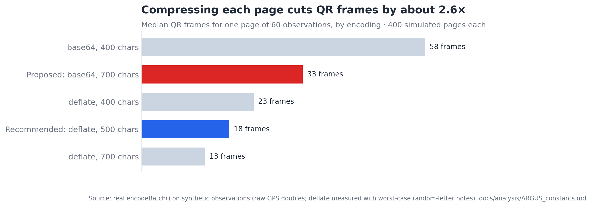
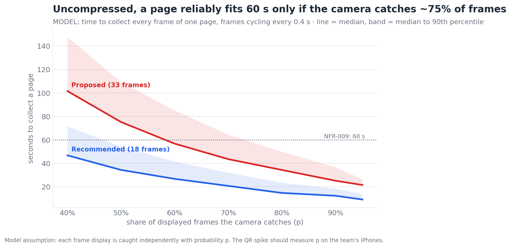

# A.R.G.U.S. · Standard analysis — are PASAbi's new constants safe to build on?

**Verdict:** the QR sizing in `IMPLEMENTATION_UPDATE.md` §5 is the one constant that doesn't hold up. A page of 60 observations encodes to a **median of 33 QR frames**, each a dense version-22 code, so NFR-009 (a page in ≤ 60 s) is met only if the camera catches most frames. **Deflate-compressing each page and using 500-character frames cuts that to 18 frames** (worst-case text), which fits 60 s with room to spare in the model. The gap-check cost confirms computing gaps per viewed incident. The freshness and coverage thresholds **cannot be tested with the data that exists**; the field test can calibrate them from data the app already stores.

`analysed 2026-09-27 · real packages/core code (encodeBatch, compute, haversineMetres) · synthetic observations: 5,000 singles, 400 pages × 60, the repo's own 3,000-observation benchmark, the 11 test vectors`

| Headline | Value |
|---|---|
| Wire size of one observation (median · p90 · worst case) | **276 · 375 · 596 bytes** |
| QR frames per 60-observation page, as proposed (base64, 700 chars) | **33** (p90 35) |
| … with deflate + 500-char frames (random-letter notes, worst case) | **18** (p90 20) |
| QR version at the library's default error correction (M), 700 → 500 chars | **v22 → v18** (105 → 89 modules) |
| Gap check, all 1,705 incident pairs · one incident vs all (laptop) | **110 ms · 0.04 ms** |

---

## Findings

### 1 · As proposed, one page needs 33 QR frames — HIGH (size) / MODERATE (time)

- **Observation.** Pages of 60 observations run through the real `encodeBatch` are a median **17.3 KB**, which is **23,098 base64 characters**, which is **33 frames at 700 characters** (p90 35). At 400 characters it would be 58 frames.
- **Evidence.** 400 simulated pages. Observations mirror what `src/app/index.tsx` stores today: raw GPS doubles from `expo-location` (about 17 digits each), UUID ids and device ids, optional note up to 140 characters, 10 % STATUS observations with 1–4 refs.
- **Interpretation.** 700 characters per frame needs **QR version 22** at error-correction level M, which is `react-native-qrcode-svg`'s default: 105 × 105 modules, **3.2 pt per module** on a 360 pt code. That is dense for phone-to-phone scanning. The RS spike's pass bar (30 frames × 700 chars in ≤ 30 s) is effectively testing this exact page.
- **Limits.** Frame counts are exact for this encoding; real notes may be longer or shorter than the simulated mix.

### 2 · Deflate + 500-character frames: 18 frames, version 18 — HIGH (size) / MODERATE (time)

- **Observation.** Raw-deflating each page before base64 shrinks it to **0.32** of the base64 size with the simulated notes, and **0.39** with worst-case random-letter notes. At 500 characters per frame that is **18 frames** (p90 20), each **version 18** at level M (89 modules, **3.7 pt per module**).
- **Model.** If the camera catches each displayed frame with probability *p*, frames cycling every 0.4 s: at p = 0.7 a page takes a median **~21 s** instead of ~43 s; the 90th percentile stays under 60 s down to p ≈ 0.5. Uncompressed pages need p ≈ 0.75 for the 90th percentile to fit 60 s.
- **Interpretation.** Compression buys the headroom; a smaller frame buys a less dense code. 500 characters is the balance: 700 would be 13 frames but back at version 19–22.
- **How.** `fflate` (MIT, pure JavaScript, ~8 KB, v0.8.3 on npm) provides `deflateSync` / `inflateSync` with no platform code, so it can live in `packages/core/qr.ts` without breaking core purity. Base64 must be a small pure function in core, not `Buffer` (absent in React Native).
- **Limits.** *p* is an assumption. The model treats each display as an independent catch, and real scanning has streaks (hand shake, glare). **The spike should measure p directly.**

### 3 · Compute gaps for the incident being viewed, not the whole board — HIGH

- **Observation.** On the repo's own benchmark (3,000 observations → **1,705 incidents**, reproducing `IncidentEngine.test.ts`), `compute()` took 14.5 ms, a full all-pairs 300 m check took **110 ms**, and one incident against all others took **0.04 ms**.
- **Interpretation.** 110 ms on a laptop is plausibly several times that on an iPhone in Expo Go's development mode, and it would rerun after every change. Per viewed incident it is free. This matches the rule already in `ARCHITECTURE.md` §3a.
- **Limits.** Laptop timing only. The benchmark's uniform random data produces mostly single-report incidents.

### 4 · Chained incidents can be wider than the gap radius — MODERATE

- **Observation.** In the benchmark, **3.5 %** of incidents span more than 300 m (99th percentile 408 m, max 612 m).
- **Interpretation.** `gapsFor` measures centroid to centroid. For a chained incident (D-010) a related report near one end can be well over 300 m from the centroid and would be listed as "not yet reported" when it has been.
- **Hypothesis.** Real floods reported along a road chain more than uniform random points, so the share is likely higher in the field.
- **Recommendation (low cost):** count a related incident as nearby if **any** of its GPS members is within `GAP_RADIUS_METRES` of **any** GPS member of the viewed incident. Per viewed incident this is still cheap.

### 5 · The existing vectors already cover all three freshness states — HIGH

- Under fresh < 1 h / stale ≥ 3 h, the 14 incidents in the 11 vectors are **10 fresh, 2 aging, 2 stale**. Vector 06's incident is **exactly 60 min** old, so it sits on the boundary and is *aging* under "fresh if age < 3600 s". Write the boundary rule into `Evidence.ts` and its fixtures explicitly (`fresh: age < 3600`, `stale: age ≥ 10800`), and add one fixture 1 s either side of each boundary.

### 6 · Rounding GPS to 6 decimals saves ~10 % — LOW priority

- Rounding `lat`/`lon` to 6 decimals (about 0.1 m, far below GPS accuracy of 3–60 m) and `accuracy_m` to whole metres cuts the median observation from 276 to 247 bytes. With deflate it saves only about one frame per page. Optional; only for new observations at creation, never by rewriting stored ones.

---

## What the data does not show

- **Whether 1 h / 3 h freshness is right.** That depends on how long information takes to reach a station, and no phone has delivered anything yet.
- **Whether 3 devices in 3 h is "high coverage".** That depends on how many phones a real purok has; the synthetic device counts are invented.
- **Whether 300 m is the right gap radius** for a real barangay's streets.
- **Real scanning speed.** Everything under "time" above is a model until the spike measures it.

## Recommended next steps

1. **QR spike (RS): measure p.** Run it at both 500 and 700 characters at level M. Count displayed frames vs caught frames, not just total time. Then read the matching point off figure 2. *(Findings 1–2)*
2. **Adopt deflate + 500-character frames** for R2 (D-027, recommended): `toWire` → `encodeBatch` → `fflate.deflateSync` → base64 → 500-char frames; the assembler reverses it. *(Finding 2)*
3. **Gaps per viewed incident, nearest-member distance.** *(Findings 3–4)*
4. **Calibrate freshness in the field test.** Every received observation already has `received_at`; on the station after the test, compute `received_at − created_at` per observation. That delivery-delay distribution is the evidence D-023 needs. *(What the data does not show)*
5. **Explicit boundary rules and ±1 s fixtures** in R1. *(Finding 5)*

Methods & assumptions

- **Code under test:** `encodeBatch`, `compute`, `haversineMetres` imported from `packages/core` and run with `tsx`. `toWire` does not exist yet; the generator emits only shared fields, which is what `toWire` will produce.
- **Observation mix (assumed):** 10 % STATUS (1–4 refs, 60 % ACK); REPORT categories uniform over all nine; 80 % with GPS (full doubles plus accuracy 3–63 m); area text when no GPS, for safe check-ins, and otherwise 40 %; people 50 %; note 60 %, length uniform 0–140, from a 44-word Filipino/English vocabulary, or random letters for the worst-case run.
- **QR versions:** `segno` minimal version, byte mode, no error boost, frame string `PSB1:abcd1234:12/34:` plus the chunk.
- **Scan-time model:** frames cycle every 0.4 s in order; each display is caught independently with probability p; 3,000–4,000 runs per point.
- **Row counts:** 5,000 single observations per variant; 400 pages per variant; 3,000-observation benchmark (seed 20260925, the repo's own) → 1,705 incidents, all with centroids.
- **Reproduce:** from the repo root, `npx tsx docs/analysis/scripts/measure.mts . > docs/analysis/scripts/measurements.json`; `RANDOM_NOTES=1 npx tsx docs/analysis/scripts/measure.mts . > docs/analysis/scripts/m_rand.json`; then `python3 docs/analysis/scripts/analyze.py` and `python3 docs/analysis/scripts/charts.py` (needs `segno`, `numpy`, `pandas`, `matplotlib`).

